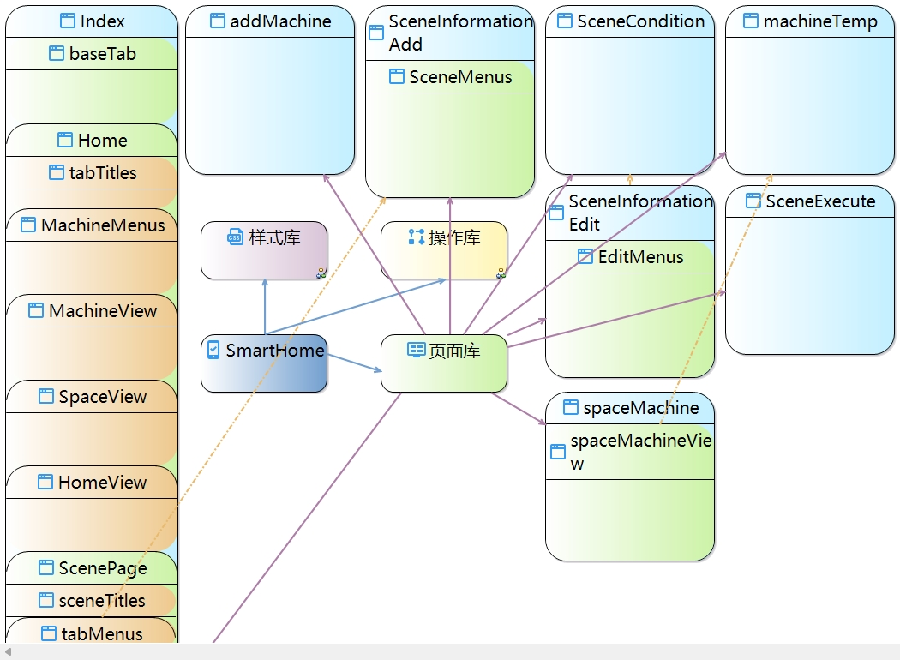
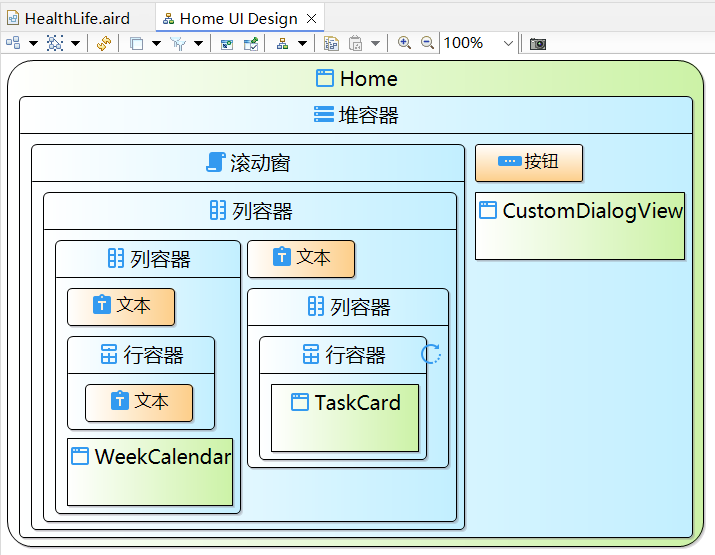
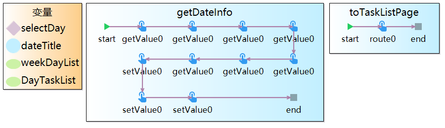
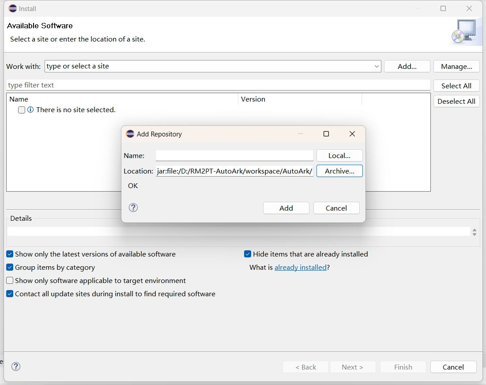
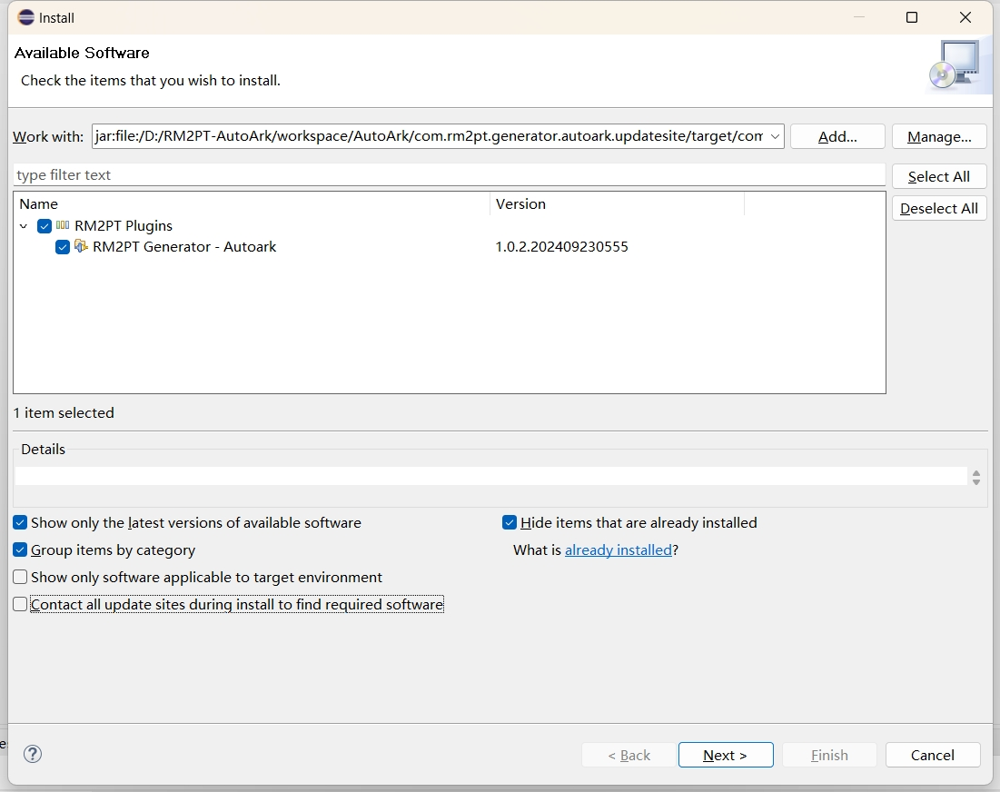
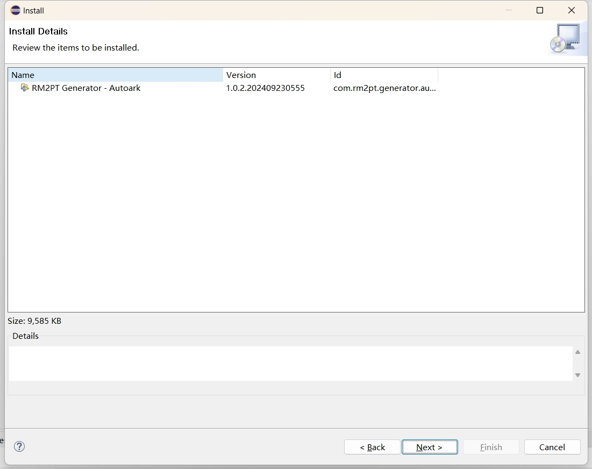
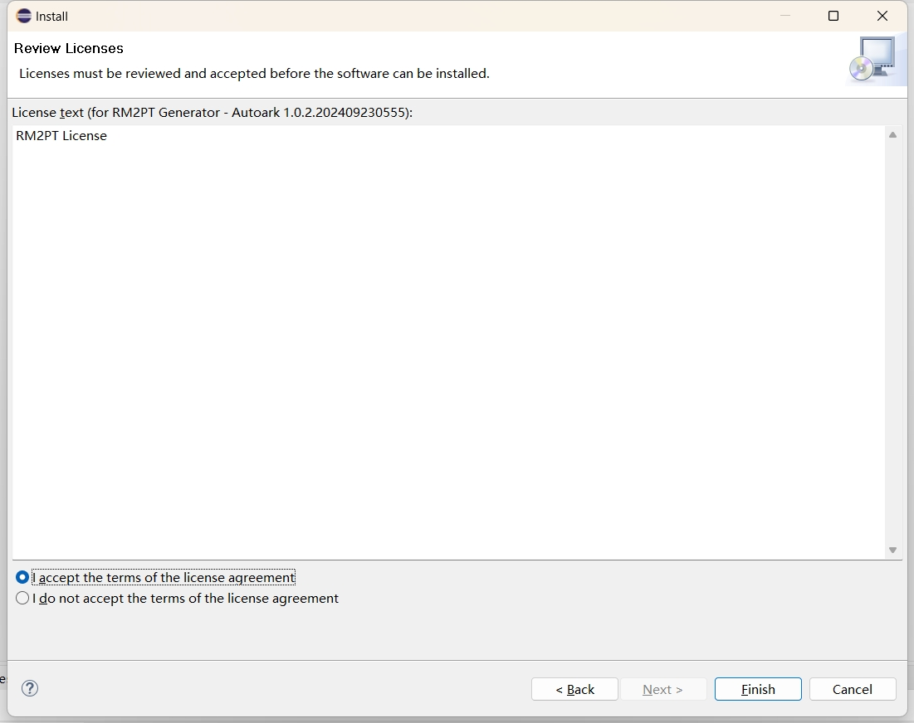
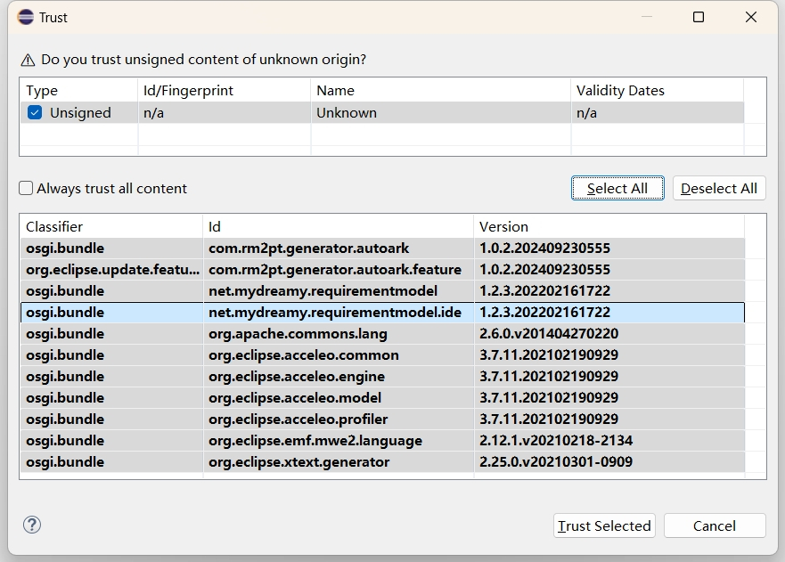
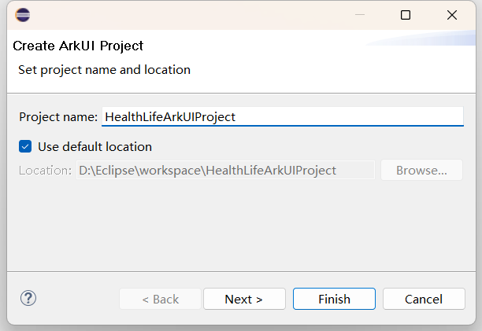
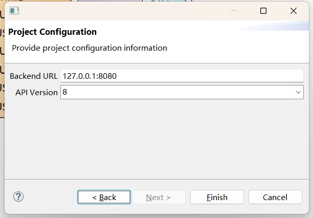

# AutoArk

AutoArk 是针对鸿蒙生态体系，基于用户友好的鸿蒙应用 GUI 元模型与图形建模语言 [ArkDSL](https://github.com/RM2PT/ArkDSL)，实现的从 GUI 模型到高成熟度前端代码的自动生成方法，以帮助华为开发自主可控的低代码 GUI 生成技术与平台，进一步推进鸿蒙生态系统的发展。借助 ArkDSL 构建的鸿蒙应用模型可以通过 AutoArk 自动转换为鸿蒙应用的 ArkUI 代码，从而帮助新接触鸿蒙应用开发环境的用户在并不了解鸿蒙应用的架构和开发方式的情况下，能够借助已有的 GUI 开发经验，快速上手鸿蒙 GUI 的设计与开发，在降低学习门槛的同时提高鸿蒙应用的开发效率。ArkDSL 的元模型从项目结构、页面结构和逻辑结构三个部分描述一个 GUI 项目，其表达能力覆盖了鸿蒙 GUI 应用的基础信息，包括元素、布局、动画、逻辑、状态等信息。

#### 项目结构视图

#### 页面结构视图

#### 逻辑结构视图

## 插件安装

AutoArk 目前以 Eclipse 插件的形式安装，依赖于 Eclipse 2022-12。用户可以按照以下步骤安装 ArkDSL 插件包。

1. 选择 Eclipse 顶部工具栏的 `Help > Install New Software...` 选项；

2. 在弹出的窗口中选择 `Add...`，再选择 `Archive...` 选项，接着选中本地的 AutoArk 插件包；

3. 勾选 `RM2PT Generator - AutoArk`，取消勾选 `Contact all update sites during install to find required software`；

4. 在下一个窗口选择 `Next >`；

5. 随后接受许可协议条款，选择 `Finish`；

6. 在新弹出的窗口选择 `Select All`，接着 `Trust Selected`，随后重启 Eclipse 以完成 AutoArk 插件安装。

## 源码编译

开发者可以在根目录下执行 `mvn clean package` 以编译项目，随后可以在 `AutoArk\com.rm2pt.generator.autoark.updatesite\target` 路径下找到编译好的 `com.rm2pt.generator.autoark.updatesite-X.X.X.zip` 插件包。

## 模型构建

利用 ArkDSL 构建鸿蒙应用 GUI 元模型的方法可以参考 [ArkDSL](https://github.com/RM2PT/ArkDSL) 插件安装。

## 生成代码

1. 右键 ArkDSL 项目内的 arkuimodel 文件，在右键菜单中选择 `ArkUI > Generate ArkUI Project` 选项，随后在弹出窗口中配置生成项目的名称和位置；

2. 在 `Next >` 页面可以配置项目的后端地址和鸿蒙 API 版本，最后 `Finish` 即可。

## 开源许可

本项目使用 MIT 许可协议，详见 [LICENSE](./LICENSE) 文件。
